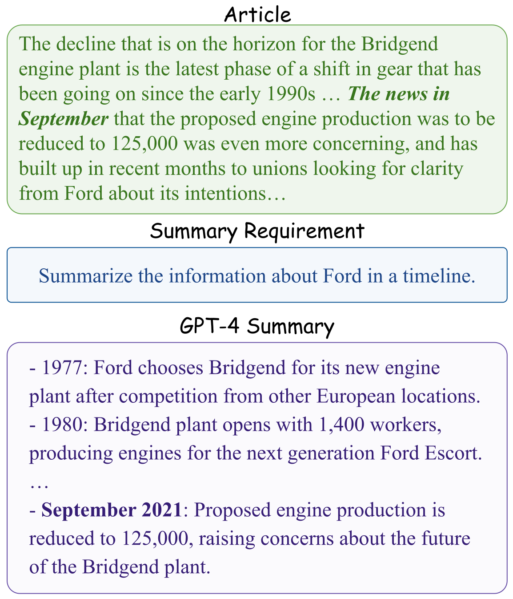

# InstruSum

This is a repository for our paper ["Benchmarking Generation and Evaluation Capabilities of Large Language
Models for Instruction Controllable Summarization"](https://arxiv.org/abs/2311.09184).

<figure style="text-align: center;">
    
</figure>

## Quick Links

- [Benchmark Dataset](#benchmark-dataset)
  - [Subset: dataset](#dataset)
  - [Subset: human_eval](#human_eval)
  - [Subset: llm_eval](#llm_eval)
  - [Subset: system_outputs](#system_outputs)
- [Prompts for LLM-based Evaluation Methods](#prompts-for-llm-based-evaluation-methods)

## Benchmark Dataset

InstruSum can be downloaded with Hugging Face Datasets under [`Salesforce/InstruSum`](https://huggingface.co/datasets/Salesforce/InstruSum).
We provide a notebook, [demo.ipynb](demo.ipynb), for exploring the dataset and performing some basic analysis.

InstruSum contains four subsets: `dataset`, `human_eval`, `llm_eval`, and `system_outputs`.

### dataset

The `dataset` subset contains 100 human-written data examples by us.
Each example contains an article, a summary instruction, a LLM-generated summary, and a hybrid LLM-human summary.

### human_eval

This subset contains human evaluation results for the 100 examples in the `dataset` subset.
There are 5 systems evaluated: OpenAI's `text-davinci-002`, `text-davinci-003`, `gpt-3.5-turbo-0301`, `gpt-4-0314`, along with the `hybrid` LLM-human summary.
We evaluated 4 evaluation aspects:
- **Overall Quality**: This rating assesses the overall quality of the summary in relation to the summary requirement.
- **Missing Information**: Does the summary omit any crucial information from the article concerning the summary requirement?
- **Irrelevant Information**: Does the summary include any information that is not relevant to the summary requirement?
- **Factual Consistency**: Is the summary consistent with the facts presented in the article, without contradicting or misrepresenting any information?

### llm_eval

This subset contains LLM-based automatic evaluation results for the 100 examples in the `dataset` subset.

We used 11 LLMs in our evaluation and 4 evaluation protocols:

- `LLMRank`: listwise ranking
- `LLMCompare`: pairwise comparison
- `LLMEval`: pointwise scoring by text completion
- `LLMScore`: pointwise scoring by model-predicted log-likelihood

In total, we evaluated 40 LLM-based evaluation methods over three quality aspects:

| LLM              | LLMRank | LLMCompare | LLMEval | LLMScore |
|--------------------------|---------|------------|---------|----------|
| `text-davinci-002`       | ✅       | ✅         | ✅       | ✅       |
| `text-davinci-003`       | ✅       | ✅         | ✅       | ✅       |
| `gpt-3.5-turbo-0301`     | ✅       | ✅         | ✅       | ❌       |
| `gpt-3.5-turbo-0613`     | ✅       | ✅         | ✅       | ❌       |
| `gpt-3.5-turbo-instruct` | ✅       | ✅         | ✅       | ✅       |
| `gpt-4-0314`             | ✅       | ✅         | ✅       | ❌       |
| `gpt-4-1106-preview`     | ✅       | ✅         | ✅       | ❌       |
| `llama-2-7b-chat`        | ✅       | ✅         | ✅       | ✅       |
| `llama-2-13b-chat`       | ✅       | ✅         | ✅       | ✅       |
| `llama-2-70b-chat`       | ✅       | ✅         | ✅       | ✅       |
| `mistral-instruct`       | ✅       | ✅         | ✅       | ✅       |

### system_outputs

This subset contains the system outputs for the 100 examples in the `dataset` subset over 11 LLMs (same as the `llm_eval` subset).

## Prompts for LLM-based Evaluation Methods

We provide the prompts for the 4 LLM-based evaluation protocols across 3 quality aspects ("overall", "missing", "irrelevant") in the [`prompts`](prompts) folder.

